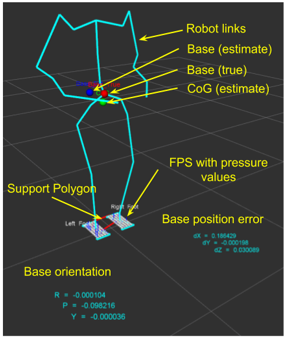

## Controlled Fall

<iframe width="700" height="400"
src="https://www.youtube.com/embed/EhVlBOKAByY"
frameborder="0"
allowfullscreen>
</iframe>

This video shows the controlled fall motion of the COMAN+ humanoid in the Gazebo simulator. The controlled fall motion in four major directions: forward, backward, left-side, and right-side are shown. The generated motion is more dynamic and it is similar to the Ukemi or parkour roll motions exhibited by trained humans. This controlled fall motion is generated using the rolling motion generation controller proposed in the paper given below:

*Subburaman, Rajesh, Nikos G. Tsagarakis, and Jinoh Lee. "Online rolling motion generation for humanoid falls based on active energy control concepts." 2018 IEEE-RAS 18th International Conference on Humanoid Robots (Humanoids). IEEE, 2018.*

### Whole-Body Control (Squatting Motion)
<iframe width="700" height="400"
src="https://www.youtube.com/embed/RGhTteXNFRA"
frameborder="0"
allowfullscreen>
</iframe>

An experimental evaluation of a whole-body inverse kinematics controller on the COMAN+ humanoid is presented here. A high-level controller generates desired velocity commands for the robot’s center of mass (CoM). The corresponding joint velocities are computed using a closed-loop whole-body inverse kinematics solver, enabling the robot to track the desired CoM motion while maintaining foot contact. The motion is generated and executed in real time. The objective of this experiment is to validate the whole-body control framework used for controlled fall motion generation. This study represents a preliminary step toward executing controlled fall motions.

### Multi-Modal State Estimate

A multi-modal state estimate is proposed by fusing the foot-pressure sensors, IMUs, and joint encoders (through forward kinematics) with an extended Kalman filter (EKF). This estimator gives not only position, velocity, and orientation of the base but also the orientation of the foot which is critical for successful execution of the above controlled fall motions in humanoids. In addition, the proposed state estimator can estimate the base accurately not just on flat terrains but also on uneven terrains. The picture shown above is an rviz visualization of the state estimator results.

* This is an unpublished work !!! *

© 2026 Rajesh Subburaman. All rights reserved.

This work is licensed under a [Creative Commons Attribution-NonCommercial-NoDerivatives 4.0 International License](https://creativecommons.org/licenses/by-nc-nd/4.0/).